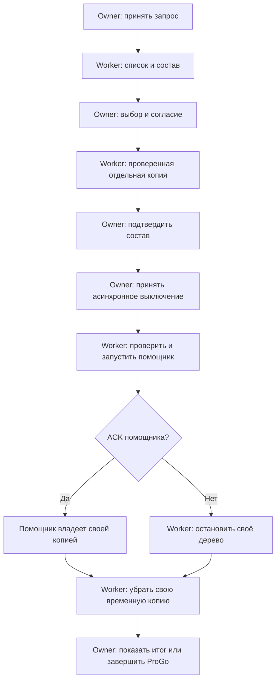

# F31o — список копий, подготовка восстановления и передача помощнику

Этап подготовлен отдельно от `c89fa32`; это не закрытие F31. Native Windows CI
для этого этапа **NOT_CHECKED**, физическая проверка Rescue/HDD/VHDX
**NOT_CHECKED**. Управляемая задержка реальной операции не является замером
физического диска.

## Граница операции

Восстановление использует тот же single-flight actor, что ручная и стартовая
копии. Список каталогов и manifest, состав для выбора, инвентаризация,
SHA-256, копирование, чтение VERSION, повторная проверка перед запуском и
ожидание помощника выполняются в worker. Смена состава и согласия работает с
готовым snapshot имён и не перечитывает накопитель. Подтверждения владельца
выполняются через постоянный UI dispatcher; Worker не открывает MessageBox.

Подготовка выключения для восстановления — отдельное reservation, а не
разрешение внешнему IPC закрыть приложение до ACK. Внешний запрос отменяет
операцию и ждёт всю задачу, включая уборку и owner publication. Даже уже
завершившийся дисковый task не допускает поздний сброс нового решения об
выходе старым результатом восстановления. `CompleteShutdown` проверяет
reservation повторно перед реальным закрытием.

Пока операция активна, создание, восстановление, очистка и обновление
взаимно исключены. Настройки и команды остановки подключений доступны до
отдельного этапа подготовки выключения. Повторный программный запуск получает
ту же задачу и открывает текущее состояние. Таймеры не создают повторных попыток.

Каждая дисковая фаза получает отмену и deadline 120 секунд. Token проверяется
между файловыми вызовами, блоками копирования и хеширования; он не прерывает
зависший вызов ОС. Worker и его временные файлы остаются во владении операции
до фактического окончания. Нормальное закрытие просит отмену, запускает уборку
и ждёт до 3 секунд; если накопитель/помощник ещё работает, приложение остаётся
открытым с понятной причиной. Dispose владельца не блокирует UI; worker
заканчивает уборку без нового owner message pump.

## Передача управления и отмена

Помощник стартует приостановленным и присоединяется к отдельному Windows Job
до выполнения первого кода. Breakaway не разрешён. Ready-event и существующая
maintenance gate остаются прежними; ожидание Ready ограничено 15 секундами.

Перед отменой/timeout Ready проверяется заново. Принятый ACK передаёт
восстановление помощнику: поздняя отмена ожидания его не откатывает и не
останавливает. Реальный restore script уже имеет собственную проверенную
копию к этому моменту и не изменяет установленную программу, пока ProGo
остаётся запущенной.

До ACK прекращается только дерево, созданное этой операцией. Отрицательный
итог возвращается после `TerminateJobObject` и подтверждения
`ActiveProcesses == 0`, включая потомков PowerShell/Add-Type. Выход одного
корневого PID не объявляется окончанием дерева. Если ОС не подтверждает
окончание, job, worker и родительская копия остаются занятыми; UI продолжает
работать, а нормальный выход отказывается после своего короткого deadline.
Это ожидание использует паузу 100 ms без повторных запусков помощника.

Job не использует kill-on-close: подтверждённый помощник обязан пережить
закрытие ProGo. Неподтверждённая ветка закрывает handles только после явного
подтверждения окончания дерева. Принудительная остановка до ACK может не
выполнить PowerShell finally помощника и оставить **его** частную временную
копию. Родитель удаляет только свои точно зарегистрированные пути, не
сканирует и не удаляет чужие `ProGo-restore-*`. При ошибке удаления своей копии
путь сохраняется, причина отражается в состоянии и журнале; успешная уборка
не выдумывается. Аварийное завершение ОС не является транзакцией этого этапа.

Формат v1 индекса, SHA-256, restore scopes, PIN, шифрование хранилища,
политики retention и сохранение текущих VPN-доступов/прокси-журналов не меняются.

## Проверки и оставшаяся работа

| Проверка | Доказательство | Статус |
| --- | --- | --- |
| Настоящие inventory/hash/copy, heartbeat, cancel, реальные lock/corruption и сохранение исходной копии | `DesktopAsyncRestoreTests.cs`: задержка внутри `BackupIntegrity`, WinForms timer, FileShare.None и сравнение хешей | NOT_CHECKED — Windows CI |
| Состав формы читается один раз; scope/consent работают после исчезновения источника; owner disposal без pump не публикует поздний успех | Та же native suite, реальные `RestoreOptionsForm` и session | NOT_CHECKED — Windows CI |
| Tray actor, общая задача, доступные Settings/Stop, короткий отказ shutdown и уборка потерянного owner | Та же native suite, настоящий context/команды; default 3s отказ, preACK IPC и искусственно задержанная публикация после реальной уборки | NOT_CHECKED — Windows CI |
| Реальные PowerShell helper и потомок: cancel/15s timeout подтверждают отсутствие всего дерева; ACK survives late cancel | Та же native suite, child подтверждает собственную подготовку и maintenance gate; установленная программа не изменяется | NOT_CHECKED — Windows CI |
| Локальные Python и публичные тексты | 39 тестов: 36 PASS, 3 SKIP; public content PASS; diff whitespace PASS | PASS — не Windows compilation/runtime |
| HDD/VHDX, CPU/RAM и физический I/O установленной сборки | Требуется проверка владельца с build identity | NOT_CHECKED |

Очистка retention и запуск updater продолжаются отдельными следующими commits.
Загрузка settings/каталогов перед message pump, startup-shortcut probe,
сохранение предпочтений при закрытии dashboard и подготовка диагностического
экспорта/открытия логов ещё требуют отдельной интеграции и проверки. Этот этап
не заявляет полный аудит всех путей UI I/O или production-ready 31/31.
