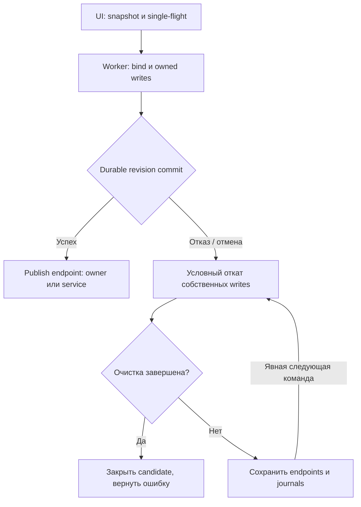

# F31l — асинхронное применение настроек и перенос HTTP-порта

F31 остаётся **OPEN**. Этот этап подготовлен поверх F31k и F31j с исправлением
принятого SSH-stop intent и durable typed-value guards F31m. Нативная сборка,
Windows-тесты и измерения установленной сборки на Rescue/HDD/VHDX ещё требуют
проверки. Задержки в тестовых seams не являются физическим измерением HDD.

## Причина и поведение

Production Settings Save и холодный запуск HTTP bridge ранее выполняли bind,
чтение журналов, запись настроек и перенос owned integrations на UI-потоке.
Ошибка после переноса могла безусловно возвращать весь старый snapshot поверх
более свежих настроек владельца или другой программы.

Теперь production использует существующий coordinator F31j. Один operation
держит integration gate и consumer/native retention leases до принятия результата.
Повторные Save/Ensure возвращают понятное состояние ожидания, не создают очередь
копий и не заменяют отслеживаемую операцию. UI продолжает обрабатывать события.

Worker резервирует и запускает candidate listener до изменения native routes.
Старый listener продолжает работать. Settings commit проверяет captured revision
в том же per-instance durable gate F31k; detached Normalize не меняет live state.
Warm и cold Start с неизменным свободным портом не записывают settings повторно.
Публикация endpoint выполняется после commit и не читает файлы. Если owner уже
уничтожен, worker завершает только service memory/socket publication, не вызывает
tray, consumers, proxy или форму. Принятый commit завершается и при позднем Cancel.

## Отмена, выход и условный откат

Форма показывает ожидание, блокирует второй Save и сохраняет введённые значения
при ошибке. Cancel/X во время операции запрашивает отмену; форма остаётся открытой
до фактического settlement. До commit token проверяется перед подготовкой,
чтением очередных chunks и native/file steps. После commit отмена не сообщает
ложный неуспех уже принятого durable save. Lifetime cancellation и 30-секундный
deadline ограничивают дальнейшие steps; они не могут прервать уже выполняющийся
системный файловый или registry вызов.

Обычный shutdown отменяет подготовку и ждёт каждую фактическую
SettingsWork/IntegrationWork не дольше 3 секунд. Если worker ещё занят,
выход отклоняется с русским сообщением;
новая команда выхода требуется после settlement. Он не начинает competing cleanup.
Перед явным Off/новой подготовкой выполняется RetryPendingCleanup; Stop/Dispose не
закрывают endpoints, нужные незавершённому откату. Scoped launch держит отдельный
consumer lease между подготовкой bridge и открытием/регистрацией окна.

Откат выполняется по per-resource receipts: registry raw value возвращается
только пока совпадает с нашим applied value; отсутствие и REG_EXPAND_SZ сохраняются.
Файл возвращается только при совпадении актуальных bytes. Позднейшая замена launcher
сохраняется. Unknown metadata в owned journals сохраняется, а только наши всё ещё
совпадающие port/typed markers возвращаются к прежним значениям. Изменённые originals,
ownership markers или неподтверждённая структура вызывают CleanupPending; candidate
и старый endpoint остаются живыми. Журналы не удаляются до settlement native steps.
Durable typed guards F31m записываются до каждого notification при переносе порта;
неудачная коррекция не теряет ожидаемый raw type при последующей очистке.

Это fresh compare перед write, а не межпроцессный атомарный CAS реестра/файлов.
Между проверкой и записью остаётся небольшой race с другой программой. In-memory
receipts не являются общей crash transaction: после аварийного завершения listener
может быть потерян. При cold Start/фоновом consumer observation несовпадение порта
settings и owned journals показывает явную диагностику и предлагает «Отключить
прокси на ПК», затем повторить подключение. Cold Start не меняет routes и не сообщает
успех до этой явной проверки/очистки. Копии восстановления сохраняются.

## Проверки и оставшиеся границы

| Проверка | Доказательство | Статус |
| --- | --- | --- |
| UI heartbeat и single-flight | Реальные SettingsService atomic replacement и cold/occupied-port prepare задержаны seams; native WinForms pump, повторные Save/Ensure, shared tracked work и команда Stop проверяются. | NOT_CHECKED — Windows. |
| Отказ записи и условный CAS | Actual settings file с FileShare.Read запрещает replacement; свежий SetAutoRestart отвергает старый save; bytes/current/revision сравниваются после settlement. | NOT_CHECKED — Windows. |
| Сохранение внешних native edits | Actual HKCU raw types/values, launcher bytes, journal metadata и ownership-marker replacement после MoveOwned; откат проверяет только наши writes. | NOT_CHECKED — Windows. |
| Незавершённая очистка | Actual launcher file lock; оба endpoints отвечают HTTP 400; после явного retry candidate освобождается, старый endpoint остаётся. | NOT_CHECKED — Windows. |
| Cancel и потеря owner | Отмена до/после commit, forced Dispose без message pump, pending form close, accepted save и отсутствие позднего UI callback. | NOT_CHECKED — Windows. |
| Ограниченный выход | Stalled settings/cold native preparation, короткий injected shutdown deadline, отказ без competing Off и явный последующий retry. | NOT_CHECKED — Windows. |
| Диагностика restart port mismatch | Actual owned env/Windows journals при saved другом порте; отсутствие холодных writes и явная cleanup recovery. | NOT_CHECKED — Windows. |
| Python/documentation/public content/diff | Проверки доступной Linux-среды. | PASS — 39 tests, 3 skipped; public content и diff-check. |
| CPU/RAM/physical disk, недоступный VPS и установленная версия | Отдельный read-only Rescue profiling script и проверка владельцем; native fault seams не заменяют её. | NOT_CHECKED. |

Оставшиеся синхронные UI paths включают startup-shortcut snapshot в конструкторе
формы, отдельный dashboard preference save, scoped shortcut/process-launch calls,
а также restore/list/maintenance paths предыдущих этапов. Primary startup backup
уже перенесён отдельным F31h worker, но это не доказывает отсутствие других задержек
во всём приложении. Legacy synchronous SaveRequested остаётся только совместимым
test/injection API; production context и standalone default формы используют worker.
Форматы vault/PIN/settings, backup policies, SSH-agent и конфигурация VPS не меняются.
Автоматических повторов и глобального применения Windows proxy этот этап не добавляет.
